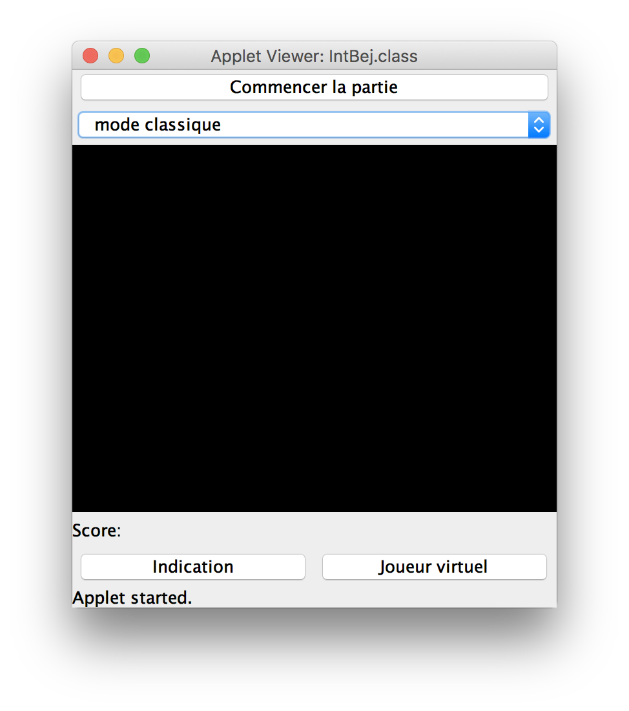
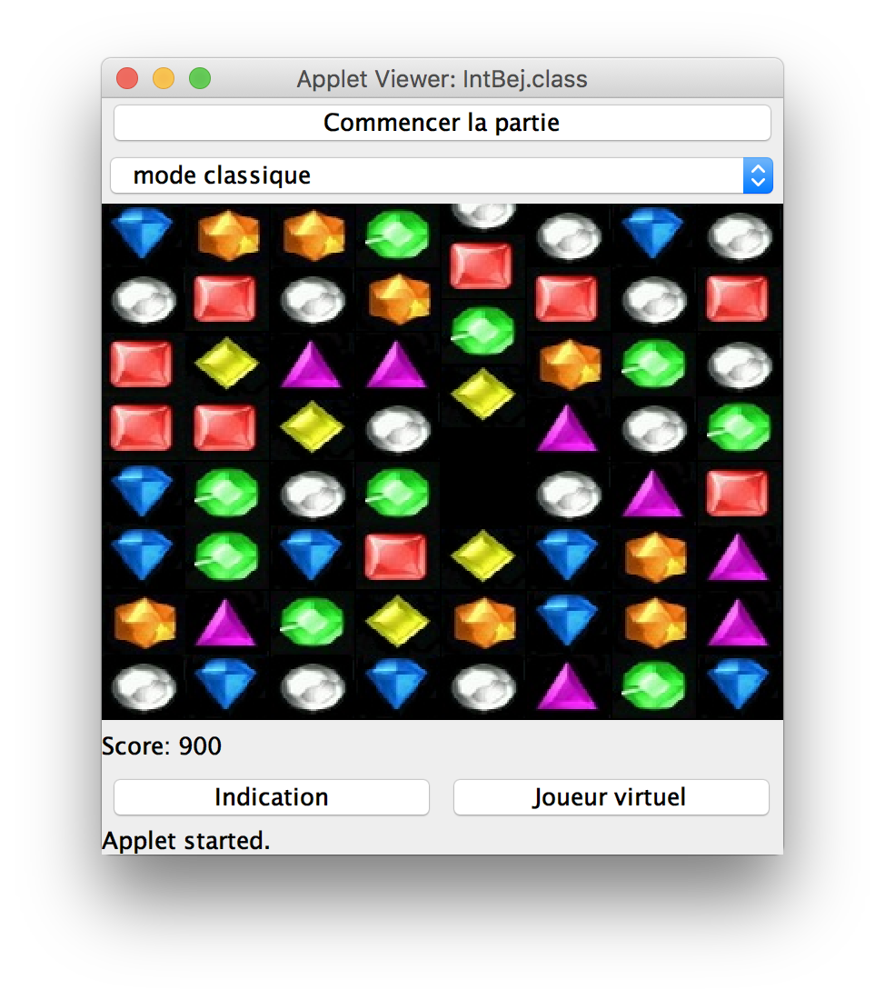

# Bejeweled
Implementation of a Bejeweled game as a Java Applet

## Installation

You will need a JDK to compile the java code.

## To run the app

In Terminal:

```bash
cd bejeweled/src
make 
make run
```


## Game settings

The player has the choice between 2 play modes:
- *classic mode*: Make the highest score, the game ends when there is no more possible move.
- *timed mode*: the timer begins with 40 seconds. Each correct move of the player adds 10 seconds to the timer. The game ends when the timer reaches zero seconds.

## App screenshots

**Start menu**:



**During the game**:



